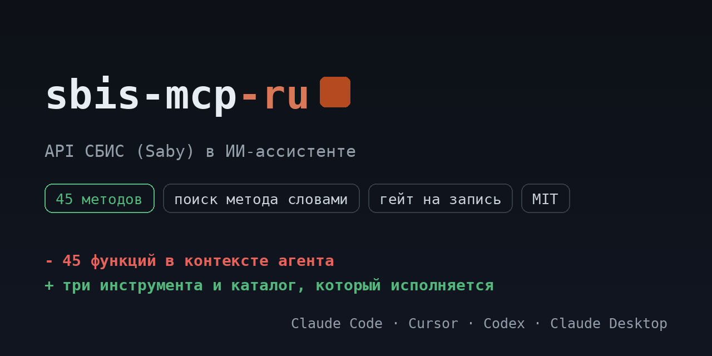

# sbis-mcp-ru

<!-- mcp-name: io.github.ilyautov/sbis-mcp-ru -->

API СБИС (Saby) для ИИ-ассистентов: документы и этапы документооборота, подписание вложений, сертификаты и МЧД, сотрудники, контрагенты, подразделения.

[](https://pypi.org/project/sbis-mcp-ru/)
[](https://github.com/ilyautov/sbis-mcp-ru/actions/workflows/ci.yml)
[](LICENSE)
[](#карта-методов)
[](https://business-mcp-ru.aifrontier.tech/sbis-api.html)
[](https://github.com/ilyautov/sbis-mcp-ru/stargazers)

[](https://vscode.dev/redirect/mcp/install?name=sbis&config=%7B%22command%22%3A%20%22uvx%22%2C%20%22args%22%3A%20%5B%22sbis-mcp-ru%22%5D%2C%20%22env%22%3A%20%7B%22SBIS_SESSION_ID%22%3A%20%22%24%7Binput%3Asbis_session_id%7D%22%7D%7D&inputs=%5B%7B%22id%22%3A%20%22sbis_session_id%22%2C%20%22type%22%3A%20%22promptString%22%2C%20%22description%22%3A%20%22%D0%98%D0%B4%D0%B5%D0%BD%D1%82%D0%B8%D1%84%D0%B8%D0%BA%D0%B0%D1%82%D0%BE%D1%80%20%D1%81%D0%B5%D1%81%D1%81%D0%B8%D0%B8%20Saby%20%28%D0%A1%D0%91%D0%98%D0%A1%29%20%D0%BE%D1%82%20%D0%BA%D0%BE%D0%BC%D0%B0%D0%BD%D0%B4%D1%8B%20%D0%A1%D0%91%D0%98%D0%A1.%D0%90%D1%83%D1%82%D0%B5%D0%BD%D1%82%D0%B8%D1%84%D0%B8%D1%86%D0%B8%D1%80%D0%BE%D0%B2%D0%B0%D1%82%D1%8C.%22%2C%20%22password%22%3A%20true%7D%5D)
[](https://cursor.com/en/install-mcp?name=sbis&config=eyJjb21tYW5kIjogInV2eCIsICJhcmdzIjogWyJzYmlzLW1jcC1ydSJdLCAiZW52IjogeyJTQklTX1NFU1NJT05fSUQiOiAiIn19)

<p align="center">
  <a href="https://business-mcp-ru.aifrontier.tech/">
    
  </a>
</p>

Каталог собран из первоисточника (справка `saby.ru/help/integration/api`) и лежит в репозитории как
`sbis_mcp/endpoints.yaml`: **45 методов**, из них 19 на чтение,
21 на запись и 5 необратимых. Сервер исполняет ровно этот файл,
поэтому таблица ниже не может разойтись с кодом.

## Установка

```bash
uvx sbis-mcp-ru
```

Claude Desktop, `claude_desktop_config.json`:

```json
{
  "mcpServers": {
    "sbis-mcp": {
      "command": "uvx",
      "args": ["sbis-mcp-ru"],
      "env": { "SBIS_SESSION_ID": "..." }
    }
  }
}
```

## Ключи

Команда СБИС.Аутентифицировать по логину и паролю сотрудника с правами на API возвращает идентификатор сессии. Сессия живёт ограниченное время и обновляется той же командой, пароль в сервере не хранится.

| переменная | секрет | что это |
|---|---|---|
| `SBIS_SESSION_ID` | да | Идентификатор сессии Saby (СБИС) от команды СБИС.Аутентифицировать. |

Ключи можно не держать в окружении: сервер умеет кабинеты и кладёт их в
`~/.ru-mcp/cabinets.json` с правами 600, вне репозитория.

## Карта методов

| раздел | методов | чтение | запись | необратимое |
|---|---|---|---|---|
| Документы и этапы | 19 | 7 | 8 | 4 |
| Аутентификация | 9 | 3 | 6 | 0 |
| Электронная подпись | 4 | 2 | 2 | 0 |
| МЧД | 4 | 2 | 1 | 1 |
| Наши организации | 3 | 2 | 1 | 0 |
| Сервисные команды | 3 | 2 | 1 | 0 |
| Сотрудники | 2 | 0 | 2 | 0 |
| Контрагенты | 1 | 1 | 0 | 0 |
| **всего** | **45** | **19** | **21** | **5** |

## Как это выглядит в чате

Вы: список документов

```
sbis_search_methods("список документов")
  sbis_spisok_dokumentov               POST /service/  чтение
  sbis_spisok_dokumentov_po_sobytiyam  POST /service/  чтение
  sbis_spisok_izmeneniy                POST /service/  чтение

sbis_describe_method("sbis_spisok_dokumentov")
  Возвращает список документов указанного типа
  POST online.sbis.ru/service/
  параметры: {"jsonrpc":"2.0","method":"СБИС.СписокДокументов","params":{},"id":0}
  класс доступа: чтение

sbis_call_method("sbis_spisok_dokumentov", {})
```

Три инструмента вместо 45 функций: агент ищет метод словами,
читает его карточку и вызывает. Запись и необратимое спрашивают подтверждение.

Что обычно просят:

- Выгрузить список документов нужного типа за период.
- Посмотреть, на каком этапе застряли исходящие документы.
- Проверить статус сертификатов подписи до того, как они истекут.
- Найти контрагента и его идентификатор участника ЭДО.

## Безопасность

Сервер работает на машине пользователя, ключи наружу не уходят. У методов три
класса доступа: чтение идёт сразу, запись и необратимые действия требуют
подтверждения. Заголовок авторизации не покидает домены сервиса даже при вызове
произвольного пути.

## Проверить установку

```bash
uvx sbis-mcp-ru doctor
```

Печатает, сколько методов загрузилось, найдены ли ключи и откуда. Секреты не
показывает. С `--live` делает один дешёвый реальный вызов на чтение.

## Родня

Ядро вынесено в [schema-mcp-core](https://github.com/ilyautov/schema-mcp-core).
Соседние серверы: [hh-mcp-ru](https://github.com/ilyautov/hh-mcp-ru), [vk-mcp-ru](https://github.com/ilyautov/vk-mcp-ru), [diadoc-mcp-ru](https://github.com/ilyautov/diadoc-mcp-ru), [chestny-znak-mcp-ru](https://github.com/ilyautov/chestny-znak-mcp-ru).
Маркетплейсы живут отдельно: [marketplaces-mcp-ru](https://github.com/ilyautov/marketplaces-mcp-ru).

MIT. Автор [Илья Утов](https://github.com/ilyautov).

Все проекты одним списком, разобранные по назначению:
[ilyautov.github.io](https://ilyautov.github.io/).

## Privacy Policy

sbis-mcp-ru не собирает и не передаёт ваши данные: ключи лежат локально в
`~/.ru-mcp/cabinets.json`, запросы идут только в API СБИС (Saby), телеметрии нет.
Полный текст: [PRIVACY_POLICY.md](https://github.com/ilyautov/sbis-mcp-ru/blob/main/PRIVACY_POLICY.md).
